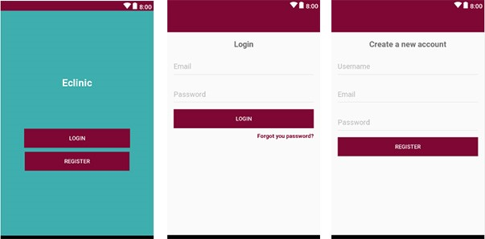
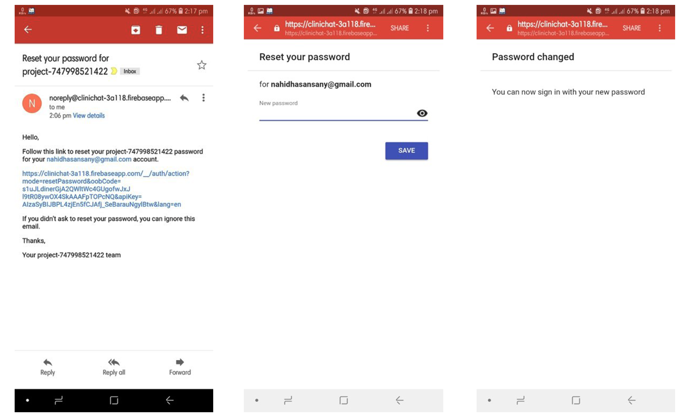
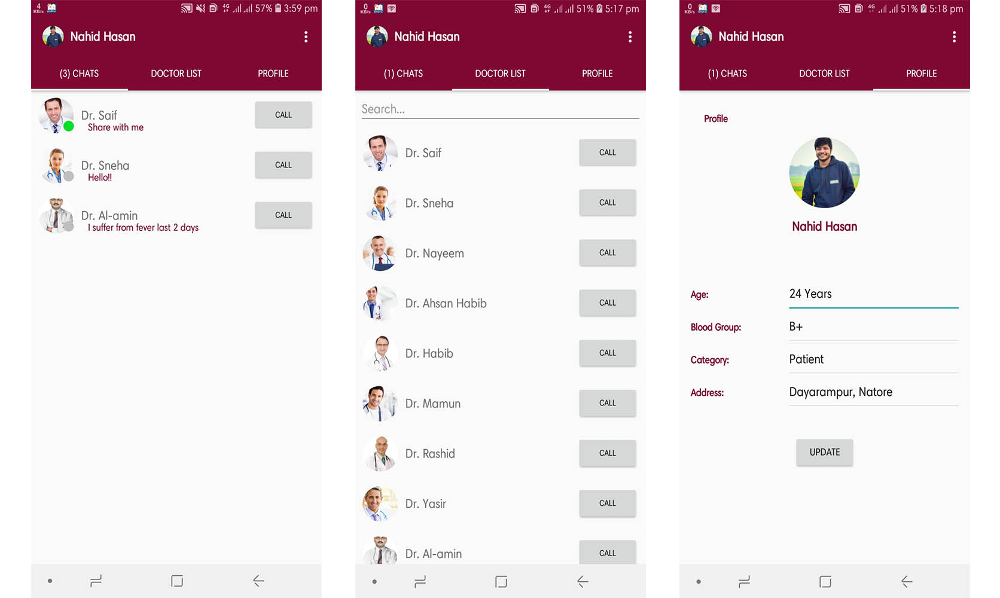
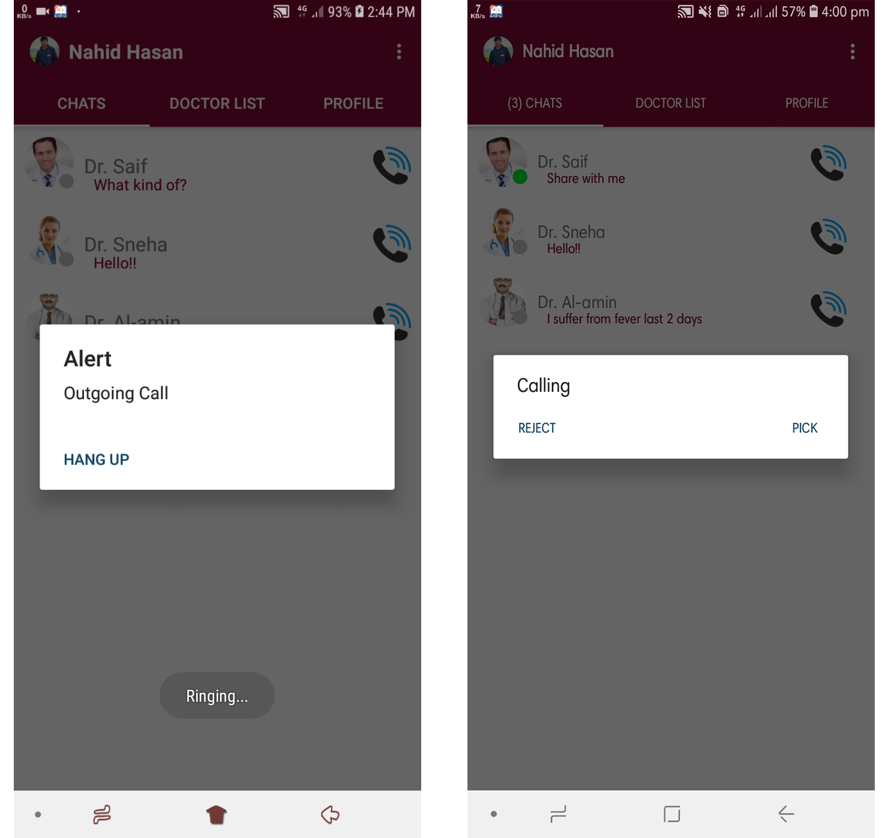

#Eclinic-sany

 I have deleted google-services.json. Add yours
 <b> Change Authorization:key with your key from firebase project</b>

 Implementation Guide 
 1 - Project
 2 - Open the Project in your android studio

 3 - Firebase Panel
 4 - Create Firebase Project (https://console.firebase.google.com/)
 5 - import the file google-service.json into your project

INSTALLATION
 When you find the app in explorer then touch Install; you’ll see a list of permissions the app is asking for. Touch each of the permissions to reveal a drop-down menu with further details about what the app wants access to. Then Click Next to finish installation.

 Check Application Permission.
 1.	Open the Settings app.
 2.	Find All Apps icon.
 3.	Touch the individual app you wish to manage or find installed eclinic app.
 4.	Touch Permissions. You’ll then see a list of the permissions that you can toggle on or off.

 Thats all, Thank you. If you like this apps which is free, Opensource and have no ads, please consider supporting us in some way. It will be hugely appreciated.

